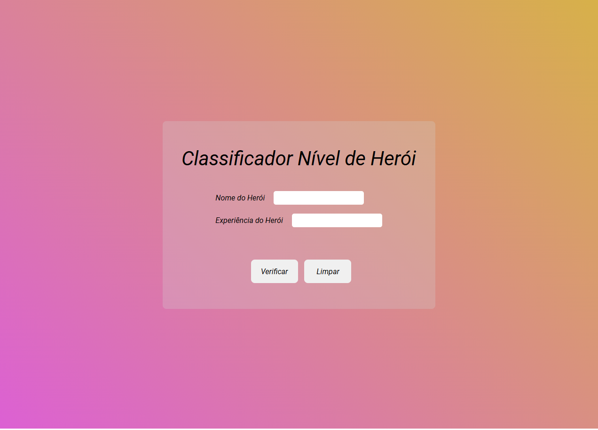
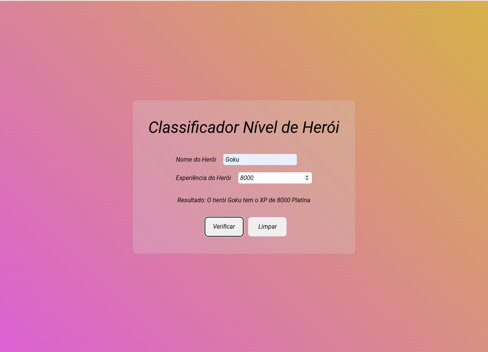

Desafio proposto pelo Felipão da DIO

<h1 align="center" style="font-weight: bold;">Hero Level Classifier </h1>

 <a href="#description">Description</a> •
 <a href="#technologies">Technologies</a> • 
 <a href="#Toplay">To Play</a> 

<h2 id="layout">🎨 Layout</h2>

    
    

<h2 id="description">📝description</h2>
 
Hello, how are you? I present the hero level classifier, where you enter the name of your hero and the experience value, so we know the level of your XP, a suggestion for creation was from Felipão DIO.
 

 
  
 <h2>😀 What the app does</h2>
 
It's a hero level rating system where you enter your hero's name and experience value, so we know their XP level.

 <h2 id="technologies">💻 Technologies</h2>

HTML5 and CSS3 were used to create the structure and appearance of the system.

JJavaScript was used to create the business logic and rules.

<h2 id="Toplay">💻 To play</h2>
<ol>
    <li>Just clone the repository to your machine. </li>
    <li>Run the file named index.html in browser.</li>
    <li>Enter the hero's name, the experience value and click check.</li>
    <li>Now you know the XP level of your favorite hero.</li>
</ul>